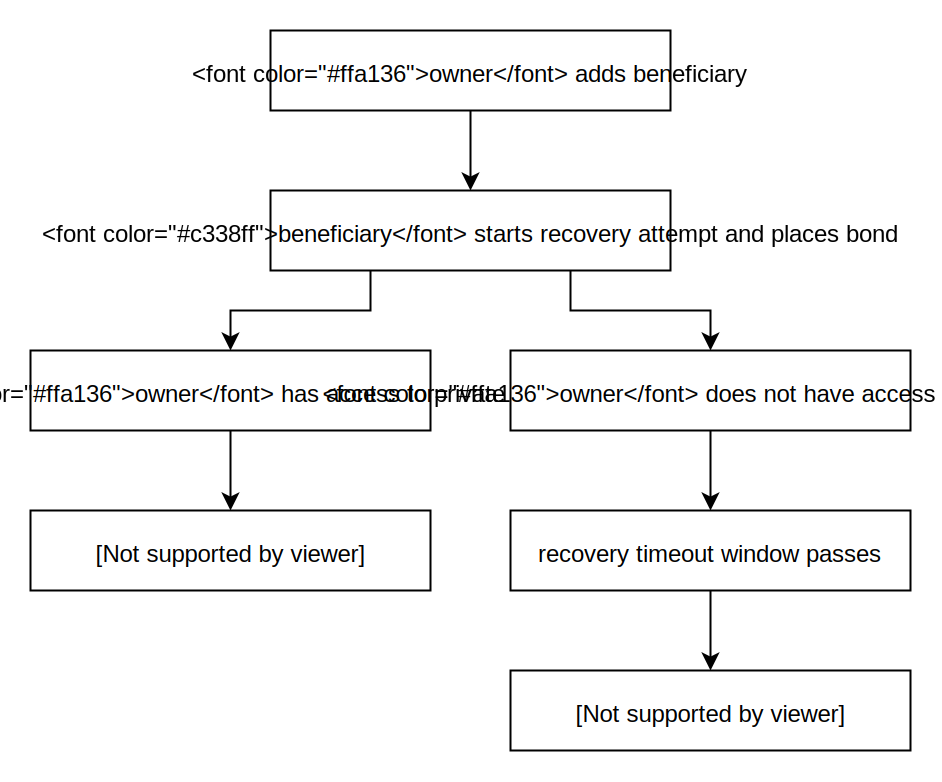

# DeadXWallet
## Overview
Crypto can be a little terrifying at times. Losing access to a private key can potentially losing access to a significant amount of money. It's important to come up with a backup plan for your crypto in the event that your keys are no longer accessible.

`DeadXWallet` is a smart contract wallet construction for worst-case scenarios. It's mostly just like a normal Ethereum wallet - you can send ETH, trade CryptoKitties, or whatever else you want. However, in the case that your keys become unexpectedly inaccessible, a pre-defined list of beneficiaries can recover the funds in the wallet. 

Although it might sound similar to social key recovery, `DeadXWallet` goes a little further than most wallets. It's important that no one, even one of your beneficiaries, is able to "recover" your funds while you still have access to your keys. In order to prevent this from happening, `DeadXWallet` requires that beneficiaries place a *bond* when attempting to recover the wallet. The owner of the wallet (you) may, at any time, cancel a recovery attempt and receive the beneficiary's bond. Once a pre-defined "timeout" window has passed and the recovery attempt has not been cancelled, the recovery can be finalized and the recovering beneficiary will become the owner of the wallet.

The required bond amount defaults to 1 ETH and the timeout period defaults to 30 days. However, both of these values can be changed by the wallet's owner. Beneficiaries can also be arbitrarily added and removed by the owner.

Here's a flow chart that illustrates how `DeadXWallet` works:

  

## License
MIT

## Disclaimer
`DeadXWallet` is **NOT AUDITED**. I claim absolutely **NO RESPONSIBILITY** for any assets lost or stolen as a result of using this software. Use this software at **YOUR OWN RISK**.

